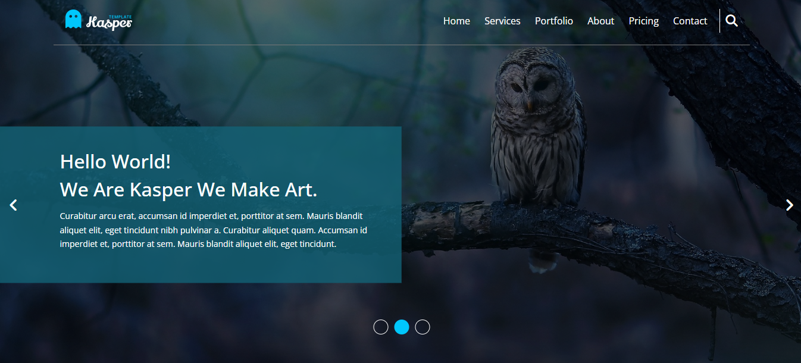

# Kasper template 



- Live Preview ⭕🔗: https://mostafasaafan5517.github.io/kasper

## Introduction

Welcome to **Kasper**, a web template that is perfect for startups, agencies, and small businesses. The template is built with simplicity in mind and is easy to customize. It features a modern and clean design, with a focus on clarity and readability. The template is fully responsive and mobile-friendly, ensuring that it works well on all devices.

## Technologies Used

Calc is built using the following technologies:

[](https://skillicons.dev)

## Installation

To run Calc locally on your machine, follow these steps:

1. Clone the repository:

   ```bash
   git clone https://github.com/MostafaSaafan5517/kasper.git
   ```

Enjoy Coding 👨‍💻
